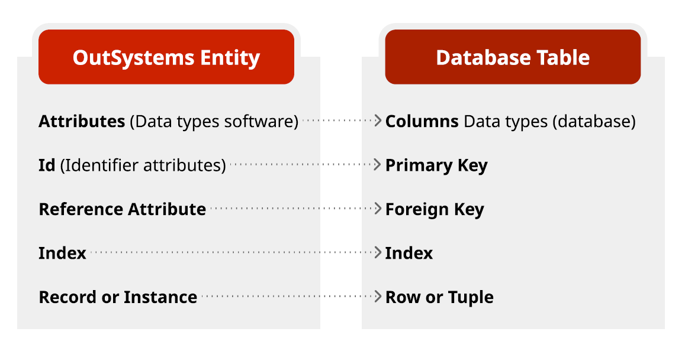

# Becoming a Web Developer

[OutSystems Training: Becoming a Web Developer | OutSystems](https://learn.outsystems.com/training/journeys/web-developer-662)

ODC includes ODC portal and ODC studio to build, deploy and manage your apps

ODC - Visual programming language; design, publish, and debug apps and libraries; web app and mobile app (android and iOS); android and iOS at the same time as the underlying code is cross-platform;

- **OutSystems overview**
    1. Platform capabilities
        1. Integration with everything - Existing applications, code and data
        2. Visual design and development
            1. Design and create entities
            2. Business logic and processes
            3. User interfaces
            4. 1-Click publish feature
        3.  S**tandard and optimized code (HTML, CSS, JavaScript, .NET)**
        4. Continuous integration and delivery - Deploy, Integrity checks, Governance, and Monitoring
        5. Flexible infrastructure - cloud or on-premise
    2. Components and tools
        1. Platform server - Compiles, deploys, manages, runs, and monitors applications
        2. Service studio - Visual design and development for web and mobile applications. Create and publish applications to the platform server. **Each version of the applications will be stored in the platform data database. The platform server will then compile and generate optimized code for those applications and deploy them to a standard application server.** The application server uses traditional databases and external systems to run the applications you have created.
        3. Integration studio - Create extensions. Provides number of accelerators to integrate with external resources such as C# code and databases. Create representations, published to server and used inside service studio as normal OutSystems resources.
        4. Service center - Platform server management and Administration console. Web application accessed via a web browser. 
            1. Factory - Published applications
            2. Monitoring - Monitor and view logs generated by running applications
            3. Administration - Administer and configure environment settings
            4. Analytics - Report
        5. LifeTime - Manage full application lifecycle across multiple environments. Web app that extends’ service center capabilities. Track applications and versions of applications deployed to any environments (Development, Quality, and Production)
            1. User Management
            2. Infrastructure management
            3. Analytics
        6. OutSystems Forge and community - Source of downloadable components that can help speed up the application’s development and delivery. Forums for discussions and Q&A.
        - **Quiz**
            1. **Which of the following is not a Development Environment? - Service Center. Service Center is a management and administration console for one environment (e.g. Development, Production).**
            2. **One of the following Tools allows you to manage the application's lifecycle across an infrastructure. Which one? - LifeTime. Besides that, it also allows you to manage IT users and teams.**
            3. **During the 1-Click Publish, your application data model, code, and interface is compiled and generates .NET code, HTML, JavaScript and CSS. True or False? True And the code that is generated is also optimized.**
- **Service Studio overview**
    1. Low code and visual development environment
    2. Create applications and modules. Define data models. Create user interfaces for web and mobile apps (Includes HTML and CSS). Define business processes and timers (batch processes). Debug your apps
    3. Download → Open → Connect to environment (cloud or on-premise)
    4. Service studio is like a client and doesn’t run applications locally. It will push the created application to the server and then you will be able to view, debug, and interact with using a browser or a mobile device
    5. Environment tab - Shared environment. Create new, open existing or install forge components. Application info, develop tab (modules), dependencies, **distribute (mobile apps - configure and generate the native mobile app and enable progressive web apps)**
    6. Low code development canvas - UI and process logic
    7. Module menu - Switch environments
    8. Forge tab - Install accelerators
    9. Workspace layout - Business processes and timers, to user interfaces, business logic flows and data related elements
- **Intro to OutSystems development**
    
    
- **Modeling Data**
    - **Modeling Data**
        1. Entities - Information or data represents various business concepts in OutSystems
        2. Database entities - Hold data that can be stored in and retrieved from the database
        3. Example Data Model
            1. Shopping App - Customers, Orders, Products, Priority, OrderStatus
            2. Entities - Defined and created in the development environment. Attributes and relationships
            3. OutSystems creates the required database table
        4. Entity to database mapping
            
            
            
        - **Quiz**
            1. **Business concepts that need to be stored and accessed in our applications should be modeled as Entities Ideally, each business concept will be mapped into a single entity.**
            2. **Which of the following mappings between OutSystems and the Database is NOT correct? Reference attribute - Primary Key. Ooops... Entity identifiers are the ones that are mapped into primary keys.**
    - **Database Entities**
        - **Database Entities**
            1. Entity - An entity is an element that allows us to persist and access information that is needed in our applications
            2. Each business concept should be represented as an entity
            3. Entity data is persisted in a database table. Each new record of an entity is inserted as a row on the corresponding table
            4. Entities - Store sets of data, have attributes, have entity actions
            5. Id Attribute - Automatically created. Uniquely identifies the record on the entity. Primary key in DB. Supports relational database operations
            6. Attributes - Entity data is stored in its attributes. Attributes represent business concepts properties. Map to a column on the respective database table. Must have a basic data type
            7. Basic Data types
                1. Alphanumeric - Text, Phone number, Email
                2. Numeric - Integer, Long Integer, Decimal, Currency
                3. Dates and Times - Data Time, Date, Time
                4. Logic - Boolean
                5. Large Object - Binary
                6. Referential - Entity Identifier
            8. Default values
                
                
                
            9. Data type inference
            10. Entity Actions - CRUD Operations. Automatically created. Used inside the application logic
        - **Demo: How to create database entity**
            1. Data tab → Entities → Database → Add Entity → Expand → Identifier (Long Integer - Auto Number) & Attributes → Entity Actions (6)
            2. Publish to create a table actually in the database
        - **Demo: How to bootstrap entity data from excel**
            1. Excel file → Entity
            2. Right click → Advanced → Create action to bootstrap data from Excel → Select Excel file → 
                1. Proceed (Shows the mapping between Excel column and Entity attributes)
                2. If columns did not match then it won’t be mapped. Matching based on column name and data type
                3. Publish
            3. Process → Timers → Bootstrap logic
            4. Timer - Background job that runs at a predefined schedule
        - **Demo: How to bootstrap entities and data from excel**
            1. Two sheets - Products and categories
            2. Data tab → Database → Import new entities from Excel
            3. Mandatory or not - Based on column filled or not
            4. Processes → Timers → Timer → Server Action
            5. Time → Schedule, Timeout in minutes, Priority
        - **Quiz**
            1. **Which of the following statements about Entities is false? Entities are only stored in memory. Entities are persistent and are actually created in the database as tables.**
            2. **If an Entity Attribute named HouseNumber is created, what needs to be done about its Data Type?** **Nothing, it will automatically be set to Integer. The OutSystems Data Type Inference mechanism handles it.**
            3. **Which of the following is not an Entity Action of the Customer Entity? RetrieveCustomer. The Entity Action that allows retrieving data is the Get.**
    - **Static Entities**
        - **Static Entities**
            1. Static entities are a special type of entity that creates a predefined list of values that can be used in our applications
            2. Static entities act like enumerations. List of items (Records) in a collection
            3. Static entities have attributes and records. Defined during design and development. Cannot be changed at runtime
            4. Only 1 entity action - The Get entity action
            5. Static entities are created with 4 default attributes - Id, Label, Order, and Is_Active. Those attributes can be changed Label > Priority. Other attributes can be added
            6. Records - Static entities have a set of records. Each record has an identifier and attribute values. The record identifier can be used in place of static entity id. Easier to remember.
        - **Demo: How to create a static entity**
            1. Data tab → Entities → Add static entity → Name and Enter → Records → Add record 
            2. Publish - Static entity created as a physical table in the database
        - **Quiz**
            1. **Which of the following is a characteristic of a Static Entity? - It contains a set of Records. As many as you want but they need to be defined during development.**
            2. **Regarding the Records of a Static Entity, which of the following options is false? The values for all 4 default attributes must be defined. Attributes of static entities can be mandatory or not. A value is only required to be set if the attribute is mandatory.**
            3. **Static Entities are most similar to which other programming concept? Enumeration. This is the closest one.**
    - **Data Modeling Exercise**
        1. 
- **UI development**
    - **UI development**
        - Screen - A screen is one of the building blocks for an interface that is composed of other elements to create rich interfaces.
        - Screen templates - Pre-built screen
        - Screen widgets -
        - The same screen will behave differently depending on the device with which users are accessing the app. It happens automatically in OutSystems
            - Desktop
            - Tablet
            - Phone
        - Screen inputs and variables
            - What is displayed to the end user can depend on data
            - Some data can be passed to the screen
                - Input parameters
            - Screens can also have local variables
                - Initialized in the scope of the screen
            - The input and local variables only exist in the scope of the screen
            - Button/link Destination -
        - Client-side logic
            - Screen actions run client-side logic in the scope of the screen. Triggered within the screen
            - Client actions - Visually modeled logic and data. Easy to call server-side logic
            - UI elements immediately react to data changes
        - Links and buttons
            - Both widgets have on click destinations - Screen, external URL, (screen) client action, event
            - The main difference between them is in the UI and interaction inside forms
        
    - **Quiz**
        1. **Screens are composed of several elements called Widgets. - True Each one of the elements (e.g. Link, Image) inside a screen is called Widget.**
        2. **What type of variables can be created inside a Screen? - Input Parameters and Local Variables. Right! Screens do not have Output Parameters.**
        3. **Which of the following options is false? - Local Variables from a Screen may be directly accessed from another Screen. The scope of Input Parameters and Local Variables is limited to the Screen where they are defined.**
    - **Widgets**
        - **Demo: How to use an expression widget**
            1. Expression widget - Computed at the runtime and generated text will be displayed
            2. Example property - Preview data
        - **Demo: How to use a link and button widget**
            - Input parameter (screen input variable) - Result of a calculation. Input parameter can be mandatory or optional
            - Button - Increment number variable. What action has to be performed? OnClick event property - Current screen
            - Passing variables between screen - Button properties specifies the value to pass to a input parameter of the new screen
            - Dragging input parameter to the screen creates an expression
            - Links works very similar to buttons.
        - **Demo: How to use if widget**
            1. If widget - Two branches. Nested If conditions
        - **Demo: How to use a container widget**
            1. Containers - Basically HTML divs on the screen. The style classes property can be used to apply CSS styles to widgets. Style influences the elements on the screen
        - **Quiz**
            1. **The Expression widget... ... displays text calculated at runtime. Expression widget displays "calculated" values, evaluated at runtime that may depend on, for example, variables.**
            2. **Which of the following behaviors is true for Links and Buttons? Links and Buttons can either Navigate to screens or trigger Screen Actions. Users can interact with the application by clicking or tapping Links and Buttons. This triggers an action, submits data or navigates to another screen.**
            3. **Regarding the If Widget, which of the following options is false? More branches can be added to an If Widget. Every If widget only has two branches: True and False.**
            4. **Regarding the Container widget, which of the following options is false? All containers must have at least one widget inside. They can actually be empty.**
    - **Using widgets exercise**
        
        Anonymous role - **By ticking the anonymous checkbox the screen will be accessible to anyone that knows the URL of the screen. Later on you'll learn how to perform role-based access control on screens**
        
- **Logic**
    - **Actions and flows**
        - **Logic actions**
            1. Action - An action is an element that allows us to define the logic flow that runs on the server or client side
            2. Actions flows - An action flow is where a piece of logic is defined. It can only have one start node. Every action flow can end with multiple nodes - End, Destination (screen actions only - web and mobile), Download (screen actions only - web). Conditional - Ifs and switches. Assigns.
            3. Actions
                1. Screen actions - Defined inside a screen. Logic specific to a single screen and usually bound to the widgets that are part of the screen. For example button click. Aggregates, input parameters, and local variables defined at the screen level. Input parameters and local variables. Several screen actions can be defined inside each screen. Screen actions may reuse other screen actions from within the same screen but not from other screens. Screen actions → Screen → Interface
                2. Client actions - Logic to be used on the device. Used throughout the module and not bound specifically within a single screen. Input parameters, out parameters and local variables. The client action can call other client actions. Client actions → Logic → Client action folder
                3. Server actions - Logic to be used on the server. Input parameters, out parameters and local variables. The server action may call itself or other server actions. Server actions → Logic → Server action folder
                
                Screen actions and client actions execute on the browser or device. Server action execute on the server. Network connection is required. Logic + action = Reusability
                
            4. Functions - Both client and server actions can be set as a Function. Restricted to one output parameter and available in expressions. Client actions set as function can’t call server actions
        - **Variables**
            1. Input parameters, output parameters, local variables, structures and list
            2. Variables - Variables are locations in memory that can hold data. Hold data of a particular data type. Can be any data type. Variables are defined and exist in a particular scope. Values can be accessed and modified in that scope. If execution leaves that scope, the variable is destroyed
            3. Input parameters - Passes a value from the outside scope. Mandatory property. 
            4.  output parameters - Returns a value to the outside scope. Value should be assigned to the output parameter inside its scope. The variable continues to exist in the outside scope even after its parent element’s scope is gone
            5.  Local variables - Exist exclusively within the scope of its  element. Variable destroyed.
            6. OutSystems language is strongly typed. Every variable must declare its data type. The data type can not change. Basic types (Integer, Text, and data), compound types (Entities and structures), and lists.
            7. Structures - Custom compound data types. Defined by attributes of any data type. Including other structures, entities, and lists. Collection of other simple, and compound data types that are grouped together. Used to store compound data in memory. A structure is the definition of a data type. The structure itself does not hold any value. Structures are not variables. Structure → End. Set its name and can be public. It’s mandatory to have atleast one attribute.
            8. Lists - A list is a collection of elements of the same data type (e.g. list of integers). Elements of OutSystems list can be basic types, compound types, a union record between different types. E.g. Integer + Text and Booking and GuestName. Lists of records can be defined in the elements tree
        - **Quiz**
            1. **Which of the following options is correct? Client Actions can call Server Actions. Similarly, Screen Actions can also call Server Actions.**
            2. **Client Actions and Server Actions can have the following variables: Input and Output Parameters, as well as Local Variables. They can have multiple input, output and local variables.**
            3. **The flow of an action can have... ... only one Start node but multiple End nodes. Action Flows can only have one Start node and can end in different End nodes.**
        - **Demo: How to create and use actions**
            1. Create order example
        - **Demo: How to create conditional paths**
            1. Odd or Even example - If widget, switch widget (otherwise is mandatory)
        - **Demo: How to create loops**
            1. Power of 2 - 2^3 = 8. Ad hoc loop implemented using If. Cyclic branch and variable to break the loop
        - **Demo: How to use JavaScript in logic**
            1. JavaScript node - input and output parameters
            2. JavaScript API documentation
        - **Quiz**
            1. **Regarding the If statement, which of the following options is false? More branches may be added if needed. Not to an If. Although in Switch statements that is possible.**
            2. Regarding the Switch statement, which of the following options is false? **Every branch that evaluates to True is executed. Only one branch of the Switch is executed: the first one that evaluates to True. If none, then the Otherwise is executed.**
    - **Exceptions**
        - **Exceptions**
            1. An exception is thrown when an operation fails unexpectedly at runtime. An exception causes an interruption in the execution of the flow. Execution is moved to an exception handler flow. Execution does not return to the original flow
            2. An exception can be raised automatically (e.g. database exception) and explicitly (raise exception)
            3. When an exception is raised, the execution is moved to the handler most specific to the exception thrown. Execution continues through that handler flow. An action flow can have several exception handler flows. Database exceptions, security exceptions, communication exceptions, and custom user exceptions
            4. Global exception handler - If a handler doesn’t exist in the current execution context. Runtime bubbles up to check any outer contexts until a matching handler is found
            5. Module global exception handler - Located in the common UI flow (default). At most one per module. Highest possible level to bubble up. Should handle all exceptions
        - **Quiz**
            1. **Inside an Action flow... ... the Exception Handler flow can't intersect other flows.**
            2. **If we have multiple Exception Handlers in an Action flow and an Exception is raised... ... the execution is moved to the Exception Handler that is most specific to the Exception.**
    - **Defining Logic exercise**
        1. Open OutSystems application → Environment → Open file → **file type to OutSystems Application Pack (.oap)**
- **Aggregates 101**
    - **Aggregates 101**
        1. An aggregate is a visual element that allows to define a query to fetch data from entities with sources, filters, and sorting
        2. Most applications need to fetch data from the database. Aggregates allow us to define database queries in a visual way. Add sources, create filters, define sorting, and test. Aggregates are easy to maintain. Excel - like display of real data. SQL knowledge not required.
        3. Sources - Entities to retrieve data from and aggregates support one or more source entities
        4. Filters - Adds one or more conditions to query to filter the output records. Support for multiple filters. Support for logical operators. Support for some built-in functions.
        5. Sorting - Define the entities attribute to sort by and which direction. Ascending or descending. When defining multiple sorts the order is relevant to the result.
        6. Test values - Allows specifying values for external variables used in the filter or sort conditions. Has as many inputs as external variables. Used to test the aggregate and preview the output records. Does not have any influence at runtime.
    - **Aggregates outputs and properties**
        1. Outputs - List of records returned. Iterator - Current, CurrentRowNumber. Row number starts from 0 to length - 1. The current cursor moves through the list when iterating. Type matches the definition in the query. Current points at first row by default. Filled in with default values if no row returned by the query. Length - Number of elements returned. Empty - True if no records were returned. Count has total number of records that match the criteria defined in the aggregate.
        2. Properties - It is possible to limit the aggregate’s output to a maximum number of records. Max. records property. Does not impact the count output. Aggregate editor is SQL-dialect agnostic. Executed SQL property shows the SQL statement generated from the aggregate. SQL is generated according to the DBMS used.
        3. Aggregates as SQL - SELECT … FROM {Entities} WHERE {Filters} ORDER BY {Sorting}. Test values are ignored at runtime. Optimized attributes fetching.
    - **Demo: How to fetch data in an aggregate**
        
        
    - **Demo: How to filter data in an aggregate**
        1. Filter - % in SQL queries
    - **Demo: How to sort data in an aggregate**
        1. Two or more sorting criteria - First one has precedence
    - **Demo: How to test values in an aggregate**
        
        
    - **Quiz**
        1.  **In an Aggregate, the Sources section is used for... Defining the Entities we want to retrieve records from. Yes! Aggregates support one or more source Entities and with relationships defined between them.**
        2.  **Considering that we can add several filters to an Aggregate, which of the following options is false? A record is included in the output if it matches at least one of the filters. For a record to be included in the output result it must be true for all filters defined.**
        3. **Regarding Sorting in Aggregates, which of the following options is correct? It is mandatory to set the direction for all sorting criteria (ascending or descending). Sorting criteria direction has to be either Ascending or Descending.**
        4.  **In an Aggregate, the purpose of the Test Values section is… To define values for testing the preview of the Aggregate's output. The Test Values section is used for testing the Aggregate and preview the output records.**
    - **Aggregates 101 Exercise**
        1. 
- **Building screens with data**
    - **Displaying data on screens**
        1. Data on screens - Screens often need to display data. Data can be fetched from databases and other sources. Widgets are used to display data on screen.
        2. Fetching data two ways
            1. Screen aggregate (database) - Visually defined like any other aggregate
            2. Data action - Retrieve data from external systems (e.g. REST). Custom logic (e.g. Advanced SQL queries)
        3. When is data fetched? Aggregates and data actions start executing when the screen is initializing. Asynchronously and in parallel. When data is available the screen renders automatically to display it
        4. Widgets to display data - Widgets are used to display the data fetched to the screen
        5. Binding the data to the widgets - Having the data and the widgets, we just need to bind them together
        6. Displaying sets of data - Source property to select the list of elements to display
        7. Displaying a specific attribute - The attribute value is fetched from the aggregate/data action output
    - **List and table widgets**
        - **Demo: How to use the list and list item**
            1. List and List item
        - **Demo: How to add swipe actions to Lists**
            1. List item swipe actions - Mobile
        - **Demo: How to use the table widget**
            1. Table - Drag and drop an aggregate. Table and other widgets are automatically created. Variables and pagination logic
        - **Quiz**
            1. **Regarding Screen Aggregates, which of the following options is false? Screen Aggregates can only be executed when explicitly called. By default, Screen Aggregates run automatically.**
            2. **How is the data fetched by an Aggregate bound to a Table or a List widget? By setting the Source property of the widget to the output of the Aggregate. The widgets have access to the output of the Screen Aggregates, so the binding can be easily defined through the Source property.**
            3. **Considering ListItem and List Actions, which of the following options is false? When List Items have the full swiping option activated, the List Action is not necessary. Yes, it is, to determine what happens on swipe. It just uses the logic defined on the List Item.**
            4. **Using the Data Action output, we display a set of all Projects on the screen. Furthermore, we intend to show the details of the chosen project on the screen. How would you do that? By setting the Source property of the List widget to the output of the Aggregate. By setting the Value property of the Expression widget to the specific attribute of the Aggregate result.**
            5. **How is the List Action defined to execute the necessary swipe action? By specifying the Client Action containing the required logic in the On-Click Destination property. To ensure the execution of the desired swipe action, it is crucial to define the necessary Client Action within the On-click Decision property.**
            6. **How can you define the desired swipe actions to reveal actions/options when swiping left and full swipe action when swiping right? Set the Full Swipe Left property to "No" and the Full Swipe Right property to "Yes." That's right! When the "Full Swipe Left" property is set to "No," swiping left will reveal actions and options, while swiping right will trigger the full swipe action.**
    - **Building a list screen exercise**
        1. Table and list example
- **Modeling data relationships**
    - **Modeling data relationships**
        1. Entity identifier - An entity must have an identifier to allow relationships. Id attribute is a long integer and automatically numbered by default. Mandatory. Possible types - Text, Possible types (text, integer/long integer, (Another) entity identifier). Can be deleted but not possible to create entity relationships. Represents the database table’s primary key. OutSystems support simple primary keys. No composite keys.
        2. Referencing an Entity - Entities can be referenced by their identifier. Create an attribute of type entity identifier. Can be mandatory or not. Static entities can only refer other static entities. Represents the database table’s foreign key. Null Identifier is the default value for reference attributes.
        3. Types of relationships
            1. One to many - Created by adding a reference attribute to one of the entities. Example - A customer can place several orders and each order belongs to a single customer, the order entity has a requested by attribute which references the customer that requested the order
            2. One to one - Created by setting the data type of one of the identifiers to be other entity identifier. Example - Order and Order Receipt. The order can have only one receipt.
            3. Many to many - Created by adding a third entity with its own identifier and two reference identifiers to the identifier within the relationship. Example - Order and product. Order can have multiple products and a product can be part of several orders, a new entity order product is created with its own id and reference attribute to order and another to the product entity. 
    - **1-to-Many relationships**
        1. Example - Customer, Order
            1. Each customer may have many orders. An order requested by one customer. A customer submits multiple orders. Order entity has a reference attribute of type customer entity (RequestedBy) Reference attribute may or may not be empty.
            2. Detail entity references the master entity. Detail entity has a reference attribute of type Master Entity identifier. An entity can have multiple reference attributes. Order entity has five reference attributes.
    - **1-to-1 relationships**
        1. Order and order receipt example - Each receipt belongs to only one order. Each order has at most one receipt.
        2. one to one relationship - Auto number is removed and ID must be explicitly assigned
        3. Shares its entities with the base entity. The two entities could be merged. Usually split apart due to performance issues and base entity is read only
    - **Many-to-Many relationships**
        1. Many-to-Many example - Order, Product and Order Product.
        2. Each product may be part of many orders. Each order may have many products. An Order Product junction entity is required. Reference attribute Order Id of type order identifier. Reference attribute Product Id of type product identifier. It’s own identifier and other attributes.
        3. New entity with its own unique Id. One reference attribute per each entity of the relationship - Master Entity 1 identifier and Master Entity 2 identifier. Unique index with both reference attributes may be useful
    - **Quiz**
        1. **Regarding data relationships, which of the following options is correct? An Entity must have an identifier to allow relationships. The relationships are created by setting an attribute with data type Entity Identifier!**
        2. **Which of the following steps is necessary to create a 1-to-1 relationship between Entity A and Entity B? Set the data type of the identifier attribute of Entity B to Entity A Identifier. Entity B will be an extension of Entity A, so they will share the same identifier.**
        3. **Which of the following steps is necessary to create a 1-to-many relationship between a Master Entity A and a Detail Entity B? Entity B must have a reference attribute of type Entity A Identifier. The Detail Entity has to reference the Master Entity.**
        4. **Which of the following steps is necessary to create a many-to-many relationship between Entity A and Entity B? Add a new Entity C, with two reference attributes of type Entity A Identifier and Entity B Identifier. Entity C will be the junction Entity that helps supporting the many-to-many relationship.**
    - **Modeling data relationships exercise**
        1. Employee, Department, Project, Employee Picture, Employee Project
- **Data Model Integrity**
    - **Data Model Integrity**
        1. Indexes - Speed up data retrieval over certain attributes. Costs additional writes and storage space. Reference attributes have automatically created indexes. Custom indexes can be created.
        2. Unique Indexes - Avoid duplicates. Define the index as unique. Combine one or more attributes.
        3. Referential integrity - Delete rule property of the reference attribute. Applied when deleting a record from the referenced entity (e.g. customer). Protect - does not allow deleting the record customer with orders is not deleted. Delete - Deletes the record and cascades delete all the records that references it. Customer and all its orders are deleted. Ignore - does not guarantee referential integrity. Customer is deleted. Orders are kept
        4. Protect and delete - Performance issues. Custom logic to handle it
    - **Demo: How to create a unique index in an entity**
        1. Customer, Order, Product example
        2. Orders with unique products
    - **Demo: How to define delete rules on foreign keys**
        1. Customer, Order example
        2. Protect, Delete property working
    - **Quiz**
        1. **Regarding Indexes, which of the following options is correct? Unique indexes help prevent data duplication. When a unique index is defined across a set of attributes, the data stored on those attributes will be unique.**
        2. **Regarding the Delete Rule property, which of the following options does not guarantee referential integrity? Ignore This options does not ensure referential integrity in the relationship and should be used with caution.**
- **Building web forms**
    - **Building reactive web forms**
        1. User interaction - Users often need to edit and submit data. Data can have different formats and data types. Text fields, List of options and date pickers. Input widgets are used to allow these interactions.
        2. Displaying and editing a record - Fetch data from the database and display it on screen. Input widgets allow end-user to add/change the data
        3. Input widgets - Input, Radio group, Checkbox, Dropdown, Text Area, Button Group, Switch
        4. Input and text area widgets - Input expects text, numbers, and dates. Text area is a multi-line field that expects text
        5. Radio group and button group - Radio group expects a group of radio buttons that provide a small number of options. Button group expects a group of buttons that provide a small number of options
        6. Checkbox and switch - Checkbox allows a user to check or uncheck an option. Switch is a toggle control that allows a user selecting between two options
        7. Dropdown - Dropdown displays a list of records from which a user can select a value.
        8. Form - Groups input widgets together. Useful to validate user data.
        9. Where is the data? All input widgets have a variable property. The value in each input field will be stored in the variable
        10. Label - Displays text to describe an input field. Input widget property creates an association with the selected input field. Provides a visual cue when associated with a mandatory field
        11. Submitting data - A form can also have other widgets. A link/button can trigger a screen action
    - **Widgets**
        - **Demo: How to use the input widget and text are widgets**
            1. 
        - **Demo: How to use the checkbox and switch widgets**
            1. 
        - **Demo: How to use the dropdown widget**
            1. 
        - **Demo: How to use the Radio group widget**
            1. 
        - **Demo: How to use the button group widget**
            1. 
        - **Demo: How to use the upload widget**
            1. 
        - **Demo: How to use the label widget**
            1. 
        - **Demo: How to use the form widget**
            1. Built in validations - Yes or No
    - **Quiz**
        1. **Which of the following behaviors does not apply to Forms? A Form has a Source property that will hold the values submitted by the user. It's actually the Inputs within a Form that has a Variable property that will have the value in each Input.**
        2. **Considering the Dropdown and the Button Group, which of the following options is false? Each Button Group Item within a Button Group has a Variable property to save the option chosen by the user. This is indeed a false statement. The Variable property actually belongs to the Button Group, which is where the value of the chosen Item will be saved.**
        3. **The Checkbox or Switch Widgets are bound to a variable of which type? Boolean That's it. True or false!**
        4. **Considering Inputs and Labels, which of the following options is correct? Labels associated with mandatory fields will display a visual cue on the Screen.**
    - **Build a detail screen exercise**
        1. 
- **Form validations**
    - **Form validations**
        
        Built-in validation — Custom validations — Validation messages
        
        1. OutSystems provides mechanisms to help implement input validations
        2. Built-in validations - Built-in validations for input widgets are performed automatically. Mandatory fields must be filled. Input values must comply with the data types of the variables bound to the widgets. Buttons/links inside a form have a built-in validations property. Set to yes to perform built-in-validations
        3. Custom validations - Inputs can have custom validations. Must be performed in the action flow. For invalid form input fields. Set the valid property to false and set the validation message. The Form.Valid property should be checked after the last custom validation. If one input is not valid, the form is automatically not valid. The form.valid cannot be explicitly changed.
        4. Multiple validations - All validations at once. Also we can leverage built-in validation property
        5. The form.valid property should be checked even if there are no custom validations. To avoid storing/manipulating invalid data. OutSystems automatically performs the validations. But it is up to the developer to leverage that in the logic
        6. Validation messages - The valid property of the input are checked when rendering the screen. If valid property is set to true. Displays the regular widget. If the valid property is set to false. Displays the regular widget. Applies the specific styling. Displays the validation message when the input gains the focus.
    - **Demo: How to use built-in form validations**
        1. OutSystems built in validations are performed automatically and consist on verifying if the mandatory fields are filled and if the data type of the value inserted matches what was expected.
        2. Built in validations property - yes (default) and condition in action flow - Validations performed and flow stops
        3. Built in validations property - no and condition in action flow - Validations not performed and flow works
        4. Built in validations property - yes and no condition in action flow - Validations performed but flow works
    - **Demo: How to define custom form validations**
        1. 
    - **Quiz**
        1. **What is the Screen behavior when a widget is not valid (Valid property set to False)? Displays the regular widget, applies a specific styling (e.g. red border), and displays the validation error message. This way we can easily identify which inputs are not valid and why.**
        2. **Which of the following options is not a built-in validation in OutSystems? Maximum length of text fields Correct! Mandatory fields and data types are the validation performed automatically by the platform.**
        3. **Which of the following options is correct regarding the Valid property of the Form? The Valid property of the Form should be checked after the last custom validation. This allows to branch the execution and avoid storing invalid data in the database.**
    - **Form validation exercise**
        1. 
- **Role based security**
    - **Role-based security**
        
        Access control — Users and roles — Checking permissions
        
        1. Access control - Access control determines and enforces who can do what
        2. Authentication and authorization
        3. End users - Built-in users application - /users. Can be created programmatically
        4. Roles - Authorization is granted via roles. Built-in roles - Anonymous and Registered. All logged in end-users have the registered role. Application specific roles can be created. Each role has Check, Grant, and Revoke actions
        5. Grating authorization - Authorization is granted via Roles. Roles can be assigned to the users. Authorization can be managed - Programmatically - Grant and revoke actions. Can be used in server actions. Manually in the users app
        6. Checking permissions - Roles can be checked in screens and actions. Screen roles property - Enforces a user to have one of the roles to access the screen. Check role name action. Checks if a user has the role. Can be used in if statements on server actions
        7. Define a user → Grant a role to a user → Define / check permissions
    - **Demo: How to grant a role to a user**
        
        
    - **Demo: How to grant a role to a user in logic**
        1. Calling server action from Data action using a function in a variable
    - **Demo: How to control authorization on screens**
        
        
    - **Demo: How to control authorization in logic**
        
        
    - **Quiz**
        1. **Considering Users and Roles in OutSystems, which of the following options is correct? By default, end-users are managed in the built-in Users application. The Users app can be accessed using the browser, where users can be created and managed.**
        2. **In OutSystems, how do we restrict access to a Screen? In the Screen Properties, untick roles to restrict their access. Correct! There's a checkbox for every Role in the app.**
        3. **Considering the built-in Role Actions, which of the following options is false? The CreateUserWithRole Action creates an end-user and assigns it the Role. This Action does not exist. This is actually a two step operation: create the user, and assign a role to the user.**
    - **Role based security exercises**
        
        
- **Debugging in OutSystems**
    - **Debugging apps**
        
        Troubleshooting applications — Debugging in service studio — Inspecting variables — Debugging a producer module
        
        1. Debugging steps - Add breakpoint → Start debugger → Run application → Debug code
        2. Add breakpoints - Server and client actions. Service studio registers the breakpoints. Breakpoints are listed in the debug panel. Can be temporarily disabled. Can be removed.
        3. Start debugger - Application will open in browser
        4. Run application - Debugger suspends execution in breakpoints
        5. Debug code - Developer can execute the code step by step. Analyze the values of variables
        6. During debugging - When the execution gets to a breakpoint, the focus returns to service studio. Regular debugging operations are available. Step over, step into, and step out. Stop, continue, suspend, abort. Break on all exceptions.
        7. Values of the variables can be inspected when execution is stopped. In use by the current statement. Locals to the scope. Screen widgets. Client variables. Global to the app (or site). Selected by the developer to always under watch.
        8. Debugging a producer module - Breakpoints stop execution of requests made to that module directly. Requests to module will stop on breakpoints inside the product manager. It is possible to stop the execution in another module’s breakpoint. Request to module to stop on product_core breakpoints. Product manager must be selected as entry module in the product core.
    - **How to debug logic in OutSystems**
        1. 
    - **Quiz**
        1. **In OutSystems, where can we place breakpoints? In Actions only (Client-side and Server-Side) Correct! Breakpoints can only be placed in action flows, regardless of whether they are client or server-side.**
        2. **In OutSystems, it is possible to inspect the values of variables while debugging. True. It's possible to inspect the values of variables when debugging the code, depending on their scope.**
        3. **Which of the following commands is not available in the OutSystems debugger? Restart Debugging You can't restart debug while its instance is being executed. You can, however, stop and start it again.**
        4. **When debugging a consumer module, how do we guarantee that the execution stops on breakpoints defined in the producer module? In the producer, set the Entry Module property to the consumer module. That's right! After this step, we can inspect the logic of any action.**
- **Advanced aggregates**
    - **Advanced aggregates**
        
        Advanced queries with aggregates — Multiple sources — Calculated attributes — Aggregating records
        
        1. Advanced queries with aggregates - Retrieving the correct data from the database can often be complex. Aggregates have some advanced options that can be easily used - Multiple sources, Calculates attributes, Aggregation functions
        2. Multiple sources - Aggregates can have multiple sources. OutSystems automatically creates the Joins when entities have relationships
        3. Join examples - Aggregates support three types of joins
            1. Only with (inner join) - Returns only records where there is a match between entities
            2. With or without (left join) - Returns all rows from the left entity even if there is no match in the right entity 
            3. With (outer join) - Returns all rows from both entities
        4. Aggregate joins in SQL - SELECT … FROM {Entity} INNER JOIN / LEFT JOIN / FULL OUTER JOIN {Entity2} ON {Condition}
        5. Hiding columns - Hide columns for previewing purposes. Does not affect the aggregate’s output. The attributes used outside the aggregate determine which columns are fetched
        6. Calculated attributes - Custom values computed from other attributes in the same aggregate. Become part of the query’s output. Expression with access to source entity attributes in the aggregate. Built-in functions. CurrDate(), DiffDate(), and variables
        7. Aggregating records - Group multiple rows together. Example - Group by orders to find # of products per order. Apply a function on a group of values - Sum, Average, Min, Max, Count
        8. Only the aggregated (blue) columns are part of the output
    - **Demo: How to fetch data from multiple sources in aggregate**
        
        
    - **Demo: How to create calculated attributes in aggregates**
        
        
    - **Demo: How to create aggregation functions in aggregates**
        
        
    - **Quiz**
        1. **Consider an Aggregate with a "With or Without" join between two entities. What is the expected output of the Aggregate? All records from the left entity even if there is no match in the right entity (LEFT JOIN). Yes! The With Or Without Join is equivalent to a LEFT JOIN, so the order of the Entities in the join matter!**
        2. **Considering that Aggregates can have hidden columns, which of the following options is correct? Hiding columns in the Aggregate only affects the preview of the output. Correct! The hidden columns will still be available in the output.**
        3. **Which of the following elements can't be used to create calculated attributes in an Aggregate? Server Actions using Entity Attributes. We can't do that! Would it be possible to translate all Server Actions into SQL?**
        4. **Consider that we want to apply aggregation functions in an Aggregate. Which of the following options is false? The output of the Aggregate will contain all attributes from the Source Entities plus the aggregation columns. Yes, this is false. Only the aggregation columns are returned.**
    - **Advanced aggregation exercise**
        
        
- **Blocks and events**
    - **Blocks**
        1. A block is a reusable user interface component that can hold widgets, patterns and other blocks
        2. Block are designed like screen. Other widgets and even blocks can be dragged into a block. Blocks have their own scope - Input parameters, local variables, and screen actions. Also placeholders and events. Blocks do not have output parameters.
        3. Can be placed inside screens or other blocks. Parent of the block. Recursion not allowed. Parents can have multiple instances of a block. Parent does not have access to elements inside the block and vice versa. Events can be used to communicate with the parent
        4. Placeholder - Reserves space for dynamic interface content. Defined when instantiated. Every instance of a block can have different content inside the placeholders. Only available inside blocks
        5. Why use blocks? Promote reusability - Develop once, use it many times across the other blocks or screens. Encapsulates its own logic, independently and isolated. Improves maintainability.
    - **Demo: How to create new block**
        1. 
    - **Quiz**
        1. **In OutSystems, a Block is a reusable UI component. Which of the following is NOT correct? A Block can only be reused once. If it's used once, maybe it doesn't need to be a Block.**
        2. **A Block can be used...  Inside Screens and Blocks, except on itself. Inside Screens and Blocks, except on itself. Although Blocks can be used inside other Blocks, they cannot be used inside themselves as recursion is not allowed.**
        3. **Regarding Placeholders, which of the following options is correct? A Placeholder reserves space in the interface to be allocated when the block is instantiated. And the content inside the Placeholder may be different for each instance.**
    - **Events**
        - **Block events**
            1. Event - An event allows a block to notify its parent of an occurrence
            2. Interaction with parent is done using events. Block triggers an event. Parent handles it. Events created inside blocks. Have input parameters to send data to the parent. Be defined as mandatory
            3. Why do we need to trigger events? Blocks and their parents have different scopes. Parent may have elements that depend on actions performed inside the block instance. Triggering an event allows the block to notify the parent.
            4. Handling events - When a block triggers an event. The event handler is executed. An event handler - Defines the logic to execute  when an event is triggered. Has access to the input parameters of the event. Has access to the parent’s scope. Screen action
            5. Event execution flow - Block → event (block) → handler → action (parent)
        - **On parameters changed**
            
            Execution flow and lifecycle
            
            1. Only available in blocks. Triggered automatically anytime the parent changes the block’s input parameters value
            2. Event lifecycle - Parameters changed → Render (block) → Render (Screen) → Render (block) → After fetch
        - **Demo: How to handle block events**
            1. 
        - **Demo: How to trigger block events**
            
            
        - **Quiz**
            1. **Regarding Block Events, which of the following options is false? Events allow to communicate with the parent element. Screens do not have a parent.**
            2. **In which of the following situations is it necessary to define a handler for a Block Event? When the Event is set to mandatory. In these cases, a Client Action must be specified to handle the event. Although it may be empty.**
            3. **In which of the following situations is the On Parameters Changed Event triggered? When the parent of the Block changes the value of at least one of the Block Input Parameters. This allows a Block to react to changes from the outside.**
    - **Blocks exercise**
        
        
- **Reactive programming model**
    - **Screen events**
        - **Screen events**
            
            On initialize (DOM loading) → On Ready → On Render (multiple times on data change) → On destroy (after rendering of new screen)→ On After fetch
            
            1. Opening the app 
                1. Initialize event → Aggregates and data actions defined at the screen level are triggered
                2. DOM loading
                3. Ready event → Screen starts to render
                4. Render event → At this point the screen and widgets ae visible to the end users
                5. After 1 fetch event - When data is fetched successfully
                6. Render event - screen re renders to display the data
                7. After 2 fetch event - When data is fetched successfully
                8. Render event - screen re renders to display the data
            
            Render event is the only one being triggered multiple times. After fetch event happens once per aggregate
            
            1. Navigating between screens - Current screen to destination screen
                1. On click - current screen
                2. On initialize - destination screen
                3. Aggregates and data actions started
                4. DOM loading
                5. Ready event
                6. Render event
                7. Now screen transition from current to destination screen
                8. Destroy - old screens
                9. After fetch
                10. Render 
            2. When to use event event
                1. Initialize - Set defaults for screen variables. Redirect the user to another screen based on a condition
                2. Ready - DOM is already available but the screen is not yet visible to the end user
                3. Render - As the screen renders the render event triggers. Useful to react to changes to data
                4. Destroy - Remove JavaScript listeners and clean the DOM
                5. After fetch - Trigger dependent queries. Validate query result
            3. Data - Input parameters, variables, aggregates and data actions, validation messages
            4. Permission before initialize
        - **Quiz**
            1. **Which of the following events is not available in Screens or Blocks? After Fetch This event is only available in Screen Aggregates and Data Actions. It acts upon data fetched from the database or server.**
            2. **Considering the Initialize event of a Screen, which of the following would be the best use case for that event? Set the default value of a Local Variable. This is the perfect place for that!**
            3. **Which of the following is the correct order of occurrence of events in a Screen? Initialize, Ready, Render, Destroy. Remember that After Fetch only occurs for Screen Aggregates and Data Actions.**
    - **Fetching data on demand**
        1. Fetch At Start - default. Asynchronous and parallel, screen initializing
        2. Fetch on demand - Programmatically refresh aggregates
- **Client variables**
    - **Client variables**
        1. Configuration variable, long-lived and user specific information, stored in the client browser
        2. Basic data types and entity identifier binary not allowed
        3. Shared across different environments  - same user and browser. Share across apps - public blocks and public client actions
        4. Stored in browser, kept on login, reset on logout or login expiry, closing the browser will not cause the loss of client variables values, avoid sensitive or confidential information
        5. Scenarios - Caching (username), user configuration settings (search keyword, items per page)
        6. Accessing - Client.VariableName - Client.EmployeesSearchKeyword
    - **Quiz**
        1. **Which of the following options is correct regarding Client Variables? Client Variables are useful to cache frequently accessed information. By caching frequently accessed values on Client Variables, it is possible to avoid requests to the server or database.**
        2. **Which of the following would be a good use case for a Client Variable? User Name Since the name of the logged-in user is shown frequently, this is a good candidate for a Client Variable.**
- **Site properties**
    - **Site properties**
        1. server side configuration variable, application wide information, store settings for your application, exists only on the server side
        2. Basic data type values and entity identifiers
        3. Values can be changed at runtime via service center and no development required, each change cache invalidation
        4. Environment specific values - development or production
        5. Example - email address, API keys, enable or disable app features, no frequent changing properties, constants
    - **Quiz**
        1. **The value of a Site Property can be modified in Service Center to change the application behavior at runtime. True The Default Value can be set at design time and modified in Service Center to be applied to the environment.**
        2.  **Which of the following is a good use case for a Site Property? REST Web Service API Key This would be a good use case!**
- **Pagination and sorting**
    - **Pagination**
        - **How to add pagination to a table**
            1. Pagination pattern - start index, max records, total count, show go to page, handler
            2. NewStartIndex - input parameter
            3. start index - variable - default to 0
            4. max records - total records in page - Variable - default 5
            5. total records - total records in table - GetEmployees.Count
            6. handler - refresh → start index = new start index, refresh aggregate
            7. Drag and drop - generates everything
        - **How to add pagination to a list**
            1. Same as table
    - **Sorting**
        - **How to add sorting to a table**
            1. Sort attribute - Employee Name - Header cell
            2. **Built in on sort event** - 
            3. **ClickedColumn** - input parameter
            4. Current sort attribute
            5. Sort attribute DESC
            6. Refresh 
            7. Dynamic sort - table sort variable
        - **How to add sorting to a list**
            1. Curly brackets for entities and square brackets for the attributes - {Employee}.[Name]
            2. On change event
    - **Quiz**
        1. **Which of the following options is correct, when implementing pagination with Tables or Lists? The Max Records property of the Pagination holds the number of records to show per page. Whereas the Start Index is the offset.**
        2. **Regarding sorting in a Table, which of the following options is correct? The On Sort event has an input parameter containing the clicked column. And that input is associated with the column that the end-user selected to sort by.** 
        3. **Regarding sorting Lists, which of the following options is correct? Other Widgets should be used to allow the end-user to define the sort criteria.Those Widgets would trigger a refresh of the data with the new sort criteria.**
- **SQL Queries**
    - **SQL queries**
        1. Advanced queries - SQL tool
        2. Can be used in server-side code. Server actions and screen data actions.
        3. SQL tools - Parameters pass information to it. No access to outside scope
        4. SQL is written manually and DBMS specific. For example - TOP vs LIMIT
        5. Use of abstract names for entities and attributes. {Entity}.[Attribute]
        6. Structures - Compound data structures
        7. Output entities / Structures - Mandatory to have at least one. Can use entities and structures
        8. Testing queries
        9. NON-SELECT queries - Insert, update and delete. A dummy output entity or structure still needs to be provided
    - **Demo: How to create a custom SELECT SQL query**
        
        
    - **Demo: How to convert an aggregate to a SQL query**
        
        
    - **Demo: How to create a custom INSERT SQL query**
        
        
    - **Demo: How to create a custom UPDATE SQL query**
        1. 
    - **Demo: How to create a custom DELETE SQL query**
        
        
    - **Quiz**
        1. **Which of the following is the correct syntax for Entities and Attributes? {Entity}.[Attribute] Entities with curly brackets and Attributes with square brackets.**
        2. **Considering Aggregates and the SQL Tool, which of the following is the correct option? The SQL Tool allows to write queries that contain sub-queries. That, and much more!**
        3. **A developer should favor using a Structure instead of the Entity in the output of a SELECT SQL Query. Do you agree with this statement? Yes, because queries will retrieve fewer Attributes and less data. By selecting only and exactly the attributes you need, you'll ensure that the output of the query is optimized.**
        4.  **Regarding non-SELECT queries, which of the following options is correct? It is mandatory to set the Output Entity or Structure. And usually you set it to the entity being manipulated.**
    - **Using custom SQL queries exercise**
